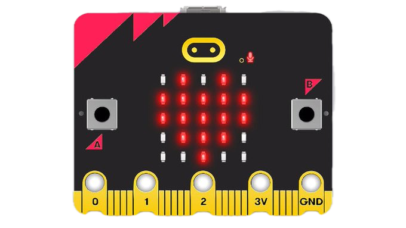
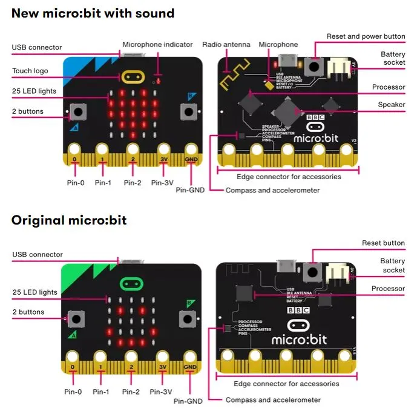

# Educators First Steps with micro:bit

## Introduction

The BBC micro:bit is a pocket-sized computer designed to make learning and teaching code easy and fun. This guide will help you introduce micro:bit to your code club effectively.

## Hardware Overview

### Built-in Features

The micro:bit has a lot of built-in sensors to help us get started on our micro:bit journey.

* 5 x 5 LED Matrix display
* 2 x programmable buttons (A+B)
* Motion sensors (Accelerometer and Magnetometer)
* Temperature sensor
* Light sensor
* Bluetooth connectivity
* 25 x External GPIO (General Purpose Input Output) pins
* USB Connectivity

### Technical Specifications

* Powered by the ARM Cortex-M0 Processor
* Can be powered by USB or Battery pack (2 x AAA batteries)
* Size 4cm x 5cm
